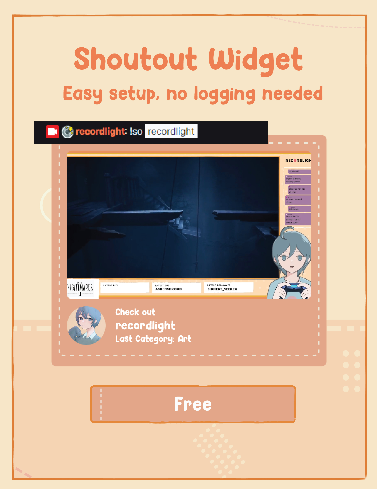
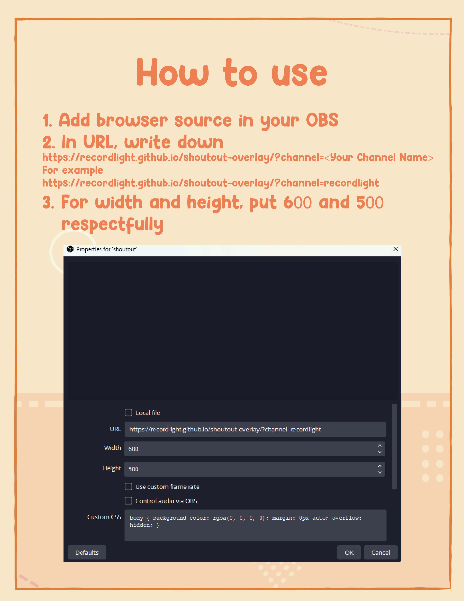
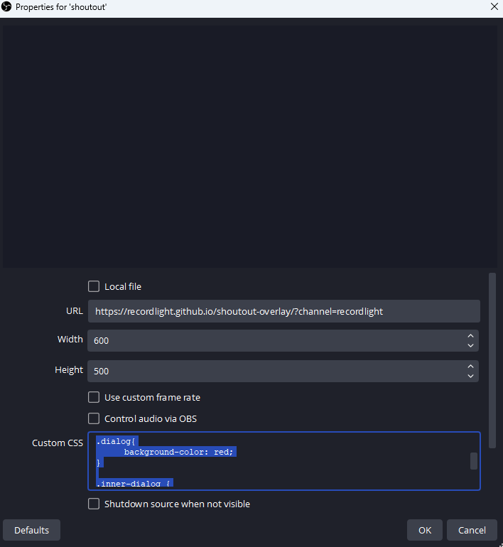

# stream-shoutout-overlay
Custom made shoutout overlay for twitch stream





# Preview
Youtube video

[](https://www.youtube.com/watch?v=YIm7S8_mzm4)

# How to use
ow to use:
Add browser source with URL: https://recordlight.github.io/shoutout-overlay/?channel=[Your channel name]

e.g. https://recordlight.github.io/shoutout-overlay/?channel=recordlight




# Customization
As of current version. You can change the color by utilizing the custom CSS part of the browsersource. To change the color of the box, you can add
```
.dialog {
     background-color: #(the six digit color you want)
}
```

The dashed dot color can be changed by adding this to the custom css part as well
```
.inner-dialog {
     border-color: #(the six digit color you want)
}
```


